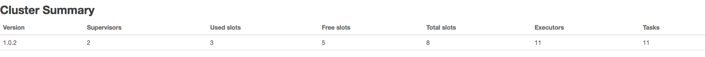

# storm UI解析

@(Storm)[storm]


## Cluster Summary


 
## Topology代码设置
``` java
TopologyBuilder topologyBuilder = new TopologyBuilder();
		
		//不设置task数量时，task数量=executors数量
		topologyBuilder.setSpout("sentenceSpout", new RandomSentenceSpout(),2).setNumTasks(4);
		topologyBuilder.setBolt("sentenceSplitBolt", new SplitSentenceBolt(),2).setNumTasks(3).shuffleGrouping("sentenceSpout");
		topologyBuilder.setBolt("countBolt", new WordCountBolt(),4).setNumTasks(6).fieldsGrouping("sentenceSplitBolt", new Fields("word"));
		
		
		Config conf = new Config();
		conf.setDebug(true);
		
		if(args != null && args.length > 0){
			conf.setNumWorkers(3);
			StormSubmitter.submitTopology(args[0], conf, topologyBuilder.createTopology());
		}else{
			conf.setMaxTaskParallelism(10);
			
			LocalCluster localCluster = new LocalCluster();
			localCluster.submitTopology("word-count", conf, topologyBuilder.createTopology());
			
			Thread.sleep(10000);
			localCluster.shutdown();
		}
	}
```

## UI界面


- Num workers = 3
> 通过conf.setNumWorkers(3);进行设置

- Num executors = 11
``` java
		topologyBuilder.setSpout("sentenceSpout", new RandomSentenceSpout(),2).setNumTasks(4);
		topologyBuilder.setBolt("sentenceSplitBolt", new SplitSentenceBolt(),2).setNumTasks(3).shuffleGrouping("sentenceSpout");
		topologyBuilder.setBolt("countBolt", new WordCountBolt(),4).setNumTasks(6).fieldsGrouping("sentenceSplitBolt", new Fields("word"));
```

   sentenceSpout 并发度是2
   sentenceSplitBolt 并发度2
    countBolt 并发度4
   另外每一个worker都会启动一个executor，用来执行acker任务，上面设置有3个worker
2+2+4+3=11

- Num tasks = 16
task数量可以通过设置spout和bolt的numTasks数量来设置，不设置时，缺省一个executor会生成一个task,executor数量<=task数量，在这里这是task数量，主要是为了后续rebalance来用的
sentenceSpout 任务数是2
sentenceSplitBolt 任务数2
countBolt 任务数4
另外每一个worker会生成acker任务，本例中有个3个worker
2+2+4+3=11


